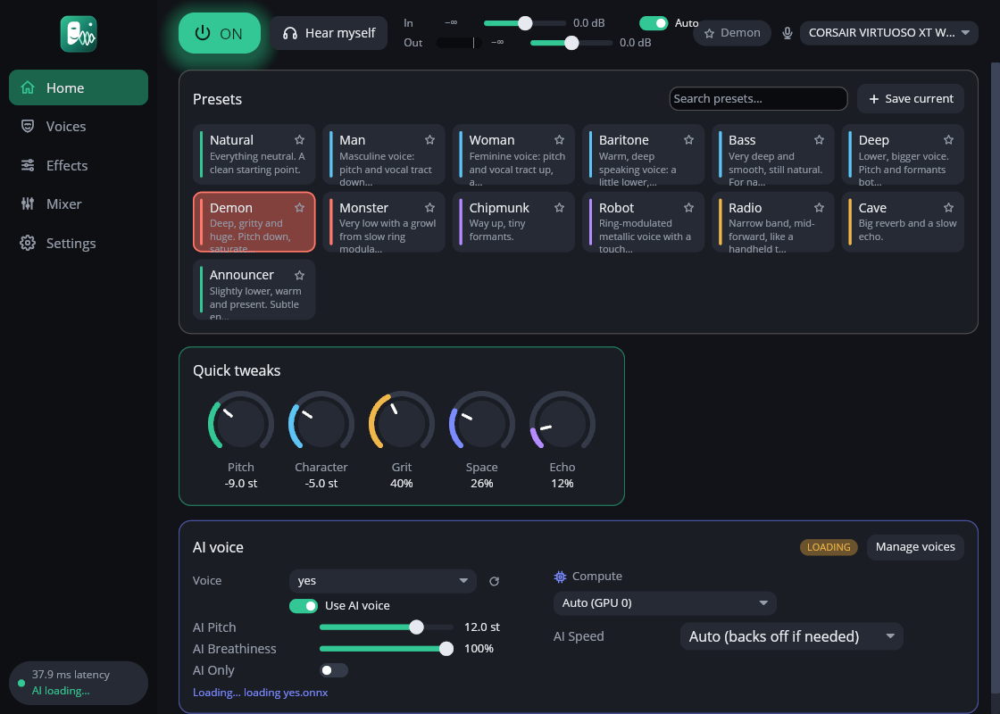
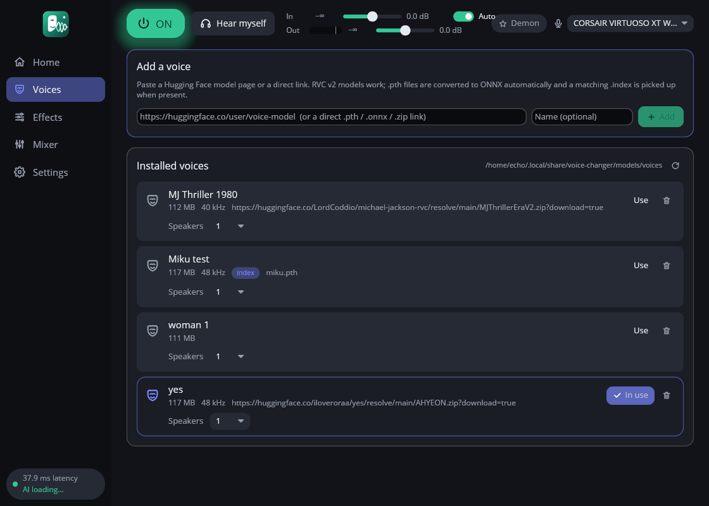
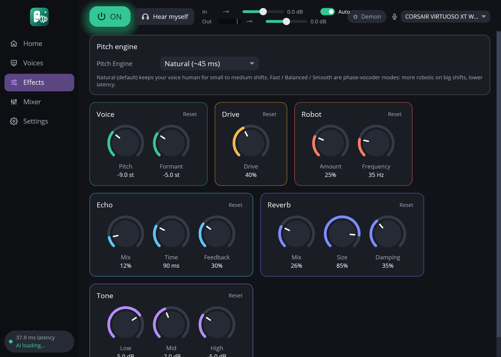
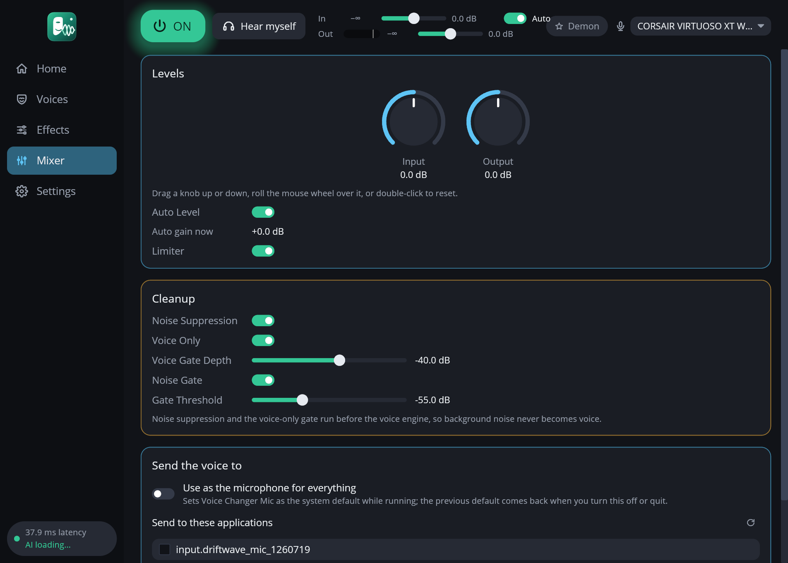
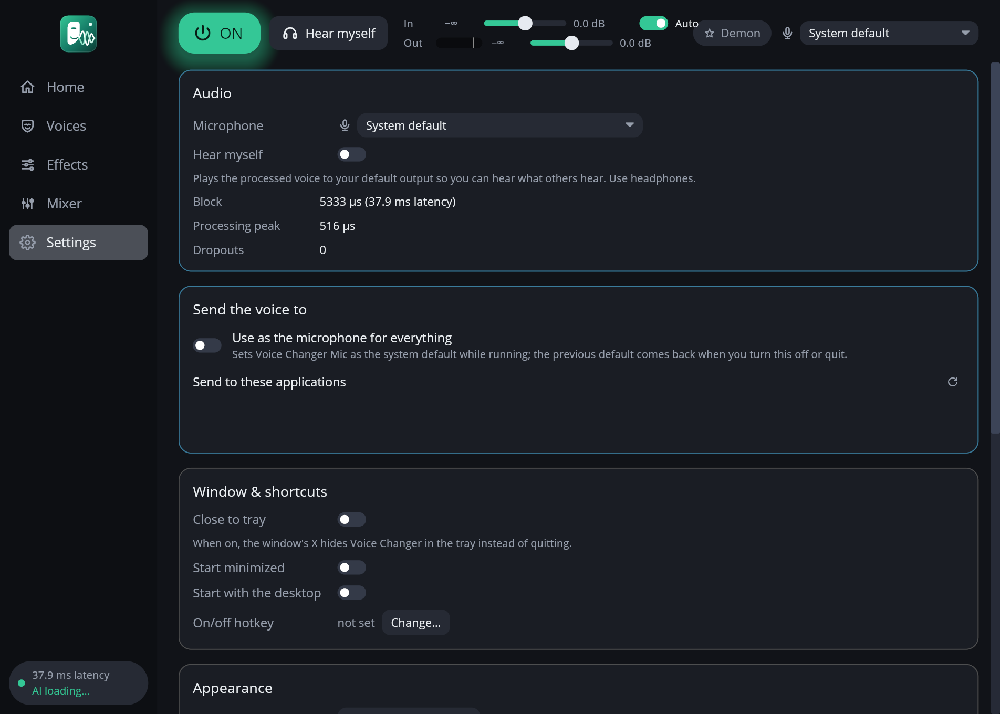

<p align="center">
  
</p>

<h1 align="center">Voice Changer</h1>

<p align="center">
  A realtime voice changer for Linux that shows up as a microphone called <b>Voice Changer Mic</b>.
  Natural pitch shifting, effects, presets and local AI voices. Discord, OBS and your softphone just pick the mic.
</p>

<p align="center">
  <a href="https://github.com/ZeroDay-Labz/voice-changer/releases/latest"></a>
  <a href="https://github.com/ZeroDay-Labz/voice-changer/actions/workflows/ci.yml"></a>
  <a href="https://github.com/ZeroDay-Labz/voice-changer/releases"></a>
  <a href="LICENSE"></a>
</p>

<p align="center">
  
</p>

## What is it?

Voice Changer sits between your microphone and everything else. It cleans the signal up,
changes the voice, and publishes the result as a new PipeWire microphone. Any app that can
pick a microphone can use it. There is nothing to configure in PulseAudio or JACK.

- **Sounds like a person.** The default **Natural** pitch engine is pitch-synchronous
  (the technique hardware voice transformers use), so shifted voices stay human instead of
  turning into a vocoder. Pitch and formant ("character") move independently.
- **Ready-made voices.** Man, Woman, Baritone, Bass, Deep, Demon, Monster, Chipmunk,
  Robot, Radio, Cave, Announcer. Star your favourites, save your own.
- **AI voices, locally.** Load any RVC v2 voice model and become that voice. Runs on the
  CPU or an AMD GPU, nothing leaves your machine. Retrieval indices are supported for a
  closer match.
- **Clean input.** Neural noise suppression (RNNoise) and a voice-only gate run before
  everything else, so fans, keyboards and breaths do not get turned into voice.
- **One big switch.** ON/OFF in the window, in the tray, on a global shortcut, or from the
  terminal with `voice-changer toggle`.
- **Hear myself.** One click plays the processed voice to your headphones.
- **Also a plugin.** The same engine and interface load as a **CLAP** plugin in your DAW.

<p align="center">
  
  
</p>
<p align="center">
  
  
</p>

## Install

| | |
|---|---|
| **Fedora** | Download the `.rpm` from the [latest release](https://github.com/ZeroDay-Labz/voice-changer/releases/latest), then `sudo dnf install ./voice-changer-*.rpm` |
| **Debian / Ubuntu** | Download the `.deb`, then `sudo apt install ./voice-changer_*.deb` |
| **Any Linux** | Download the `.tar.gz`, unpack it, run `./voice-changer`. The CLAP plugin is in the same folder. |
| **Flatpak** | Coming. A draft manifest lives in `packaging/flatpak/`. |
| **From source** | See [Building](#building). `scripts/install.sh` builds and installs everything for your user. |

The packages install the app, the CLAP plugin (`/usr/lib64/clap/` or `/usr/lib/clap/`), a
launcher and the icon. AI voice models are downloaded separately (see [AI voices](#ai-voices)).

Requirements: PipeWire (any distribution from the last few years), a Wayland or X11
desktop. The GPU build additionally needs Fedora's `onnxruntime-rocm` package.

## Using it

1. Start **Voice Changer** from your launcher (or run `voice-changer`).
2. Pick a preset on **Home**, or turn the quick-tweak knobs.
3. In Discord, OBS, your softphone, choose **Voice Changer Mic** as the input device.
4. Tick **Hear myself** to check how you sound. Use headphones.

| Where | What |
|---|---|
| **Home** | Preset cards with search and favourites, quick tweaks (Pitch, Character, Grit, Space, Echo), the AI voice card |
| **Voices** | Import AI voices from a link, list and delete installed ones, download the base models |
| **Effects** | Pitch engine, Voice, Drive, Robot, Echo, Reverb, Tone |
| **Mixer** | Input and output gain, auto level, limiter, noise suppression, voice-only gate, noise gate |
| **Settings** | Microphone, hear-myself, close to tray, start minimized, autostart, hotkey, theme, log |

Knobs: drag up or down, roll the mouse wheel, double-click or right-click to reset. Sliders
take the wheel and reset the same way. Hover any control for a moment and it explains itself.

**Where the voice goes.** Any app can pick **Voice Changer Mic** in its own settings. The
Mixer page's *Send the voice to* section does it for you: **Use as the microphone for
everything** makes it the system default while the app runs (your previous default comes back
when you turn it off or quit), and the list below sends it to individual recording
applications, Discord, OBS, a browser tab, without touching anything else.

| Shortcut | Action |
|---|---|
| `Ctrl+M` or `Ctrl+Space` | Toggle on/off (window focused) |
| `Ctrl+H` | Hear myself |
| `Ctrl+1` … `Ctrl+5` | Home, Voices, Effects, Mixer, Settings |
| `Ctrl+,` | Settings |
| `Ctrl+F` | Search presets |
| `Ctrl+S` | Save the current settings as a preset |
| `Esc` | Cancel a save or delete prompt |
| `Ctrl+Q` | Quit |
| `Ctrl+Shift+M` | Global toggle, from any app (desktop portal; change it under Settings → On/off hotkey) |

Closing the window quits and saves your state. Turn on **Close to tray** in Settings if you
would rather have it keep running in the tray.

### From the terminal

Everything the window does is also a command against the running instance:

```sh
voice-changer                      # window + tray + virtual mic
voice-changer toggle               # flip on/off (bind this to a key if the portal shortcut is unavailable)
voice-changer on | off | status
voice-changer preset Robot         # apply a preset; `presets` lists them
voice-changer mics                 # list microphones; `mic <node.name>` switches, `mic default` resets
voice-changer monitor on           # hear yourself; `monitor off`
voice-changer apps                 # who is recording and whether they get the voice
voice-changer route Discord on     # send the voice to an application; `route Discord off`
voice-changer default on           # be the default microphone for everything; `default off`
voice-changer ai "Nice Voice"      # switch on an AI voice; `ai off`; `ai-voices` lists them
voice-changer voices               # installed voice models
voice-changer voices add https://huggingface.co/user/voice-model "Nice Voice"
voice-changer voices remove "Nice Voice"
voice-changer show | quit
voice-changer --quantum 512        # bigger audio block if you hear dropouts
voice-changer --help
```

## AI voices

Any **RVC v2** model works, which is the format almost every community voice comes in.

1. **Base models.** The Voices page offers a one-click download of ContentVec and RMVPE
   (MIT licensed, about 740 MB), or run `scripts/get-models.sh`.
2. **Add a voice.** Paste a Hugging Face model page or a direct `.pth` / `.onnx` / `.zip`
   link into **Voices → Add a voice**. `.pth` files are converted to ONNX automatically
   (the first conversion sets up a small Python environment, about 300 MB). A matching
   `.index` file is picked up when the repository or zip has one.
3. **Use it.** Press **Use** on the voice, or pick it on the Home page's AI card.

**Voices with more than one speaker.** Some models are trained on two takes, say a male and a
female version, selected by RVC's speaker id. RVC files do not record how many speakers a
model has, so on the Voices page set **Speakers** to 2 (or more) for that voice; a
**Speaker** picker then appears on the Home page, switching is instant, and **Starts as**
pins the speaker the voice always begins with. You can name the speakers ("Male",
"Female") right there. From the terminal: `voice-changer ai "Nice Voice" 2`.

Where to find voices: Hugging Face (search "RVC"), [voice-models.com](https://voice-models.com),
the AI Hub community. Check each model's licence and the voice owner's consent before using
a voice publicly. The app ships no voices.

Tips for the most natural result:

- **AI pitch** matters most. Set it so the converted voice lands in the model's natural
  range: +12 for a typical male→female model, 0 or −12 the other way. Leave the DSP
  **Pitch** at 0.
- **Breathiness** scales the model's noise excitation. Lower for a cleaner voice, higher
  for more texture.
- **Index strength** appears when the voice has a retrieval index. Around 75% keeps the
  model's timbre; lower if words become unclear.
- **AI only** (on by default) bypasses the DSP voice and effects while AI runs. Turn it off
  to layer Robot, reverb or extra pitch on top.
- Prefer models trained for 300+ epochs on an hour or more of clean speech, at 40k or 48k.
- **AI speed** (Auto) backs off to longer blocks automatically if your CPU falls behind.
  Expect 0.5–1 s of delay in AI mode; it needs a block of speech before it can convert it.

### Compute: CPU or GPU

**Compute** on the AI card picks Auto, CPU or a specific GPU; the models reload when you
change it. On the CPU expect about 60–80% of eight cores on a Ryzen 5950X for a 48 kHz
model. On an AMD GPU the content and pitch models run 4–5× faster and the voice sees a full
second of context per block, which keeps the timbre steadier.

The app loads ONNX Runtime at start and uses whichever it finds first:

| Runtime | Where it comes from | Result |
|---|---|---|
| ROCm build | Fedora: `sudo dnf install onnxruntime-rocm` (or `ORT_DYLIB_PATH`) | AMD GPUs appear under Compute |
| CPU build | bundled with the packages, `scripts/get-onnxruntime.sh`, or the distribution's `onnxruntime` | CPU only |

Settings → Audio shows which library is loaded. The first load of a voice on the GPU compiles
kernels, which takes tens of seconds and is cached in `~/.cache/miopen`.

## Plugin

`cargo xtask bundle vc-plugin --release` writes `target/bundled/vc-plugin.clap`; the
packages install it system-wide and `scripts/install.sh` puts it in `~/.clap/`. The editor
is the same interface as the app, minus the microphone and window settings. VST3 can be
built with `--features vst3` (mind Steinberg's licensing terms).

## Latency

| Path | Added delay at 48 kHz, 256-frame block |
|---|---|
| Natural engine | ≈ 45 ms engine + one block (5 ms) |
| Fast / Balanced / Smooth | ≈ 20–60 ms depending on mode |
| Noise suppression | + 10 ms |
| AI voice | + 0.5–1 s (needs a block of speech to convert) |

The current figure is shown in the sidebar. `--quantum 128` shaves 2.7 ms if your
interface copes; USB headsets usually do not.

## Troubleshooting

- **Pops or crackle.** Check the sidebar for "dropouts". Start with a bigger block
  (`voice-changer --quantum 512`), then run `pw-top` while speaking: an `ERR` count rising
  on your microphone or on `voice_changer.*` nodes confirms PipeWire xruns.
- **Words get cut.** Turn off **Voice only** in Mixer, or raise **Voice Gate Depth**
  (e.g. −20 dB) so more passes between words.
- **No "Voice Changer Mic" in an app.** The node exists only while the app runs. Flatpak
  apps need PipeWire access (`--filesystem=xdg-run/pipewire-0`).
- **Global shortcut does nothing.** Your desktop may lack the GlobalShortcuts portal. Bind
  `voice-changer toggle` to a key in System Settings → Shortcuts → Custom instead.
- **AI "error" or "loading" forever.** Settings → Log shows why. Common causes: base models
  missing (Voices page), a v1 model (256-dim) instead of v2, or a GPU runtime that is not
  installed (`sudo dnf install onnxruntime-rocm`).
- **Test without talking.** `voice-changer --input-wav speech.wav --monitor` loops a file as
  the microphone.

## Where your stuff is kept

| | |
|---|---|
| Settings and last state | `~/.config/voice-changer/config.ron`, `state.ron` |
| Launcher and icons (written on first start unless a package installed them) | `~/.local/share/applications/`, `~/.local/share/icons/hicolor/` |
| CPU ONNX Runtime (when fetched by the install script) | `~/.local/lib/voice-changer/` |
| Your presets and favourites | `~/.config/voice-changer/presets/*.ron`, `favorites.txt` |
| Base models and voices | `~/.local/share/voice-changer/models/`, `models/voices/` |
| Converter environment | `~/.local/share/voice-changer/tools/` |

**Open data folder** on the Settings page takes you there.

## Building

```sh
# Fedora
sudo dnf install pipewire-devel clang gcc-c++ libxkbcommon-devel wayland-devel
# Debian / Ubuntu
sudo apt install libpipewire-0.3-dev libclang-dev pkg-config libxkbcommon-dev libwayland-dev build-essential

git clone https://github.com/ZeroDay-Labz/voice-changer && cd voice-changer
scripts/install.sh              # app + CLAP plugin + launcher into ~/.local (GPU-capable)
scripts/install.sh --cpu-only   # without the dynamic runtime loader
cargo run                       # or just run it from the tree
```

Rust 1.88 or newer. `cargo test --workspace` runs the DSP and index tests;
`cargo clippy --workspace --all-targets` must stay clean. See [CONTRIBUTING.md](CONTRIBUTING.md).

| Crate | Purpose |
|---|---|
| `vc-dsp` | Realtime-safe engine (no allocation or locks in `process`) |
| `vc-core` | Parameters, presets, pipeline, AI inference and voice library |
| `vc-gui` | iced interface shared by the app and the plugin |
| `vc-app` | Standalone: PipeWire virtual mic, window, tray, hotkey, D-Bus, CLI |
| `vc-plugin` | CLAP (and optional VST3) plugin via nice-plug |

## Notes

- Mono, 48 kHz internally; multichannel plugin inputs are folded to mono and fanned out.
- The D-Bus interface is `org.voicechanger.Control` on the session bus; the CLI is a thin
  client for it.
- ONNX Runtime upstream dropped its ROCm build; the GPU feature loads the distribution's
  `onnxruntime-rocm` library at runtime instead.
- Screenshots in this README are rendered by the app itself:
  `voice-changer --screenshot docs/screenshots/home.png --page home`.

## License

MIT. See [LICENSE](LICENSE). Voice models you download have their own licences.
